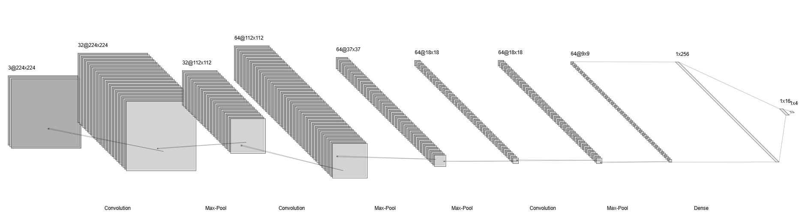
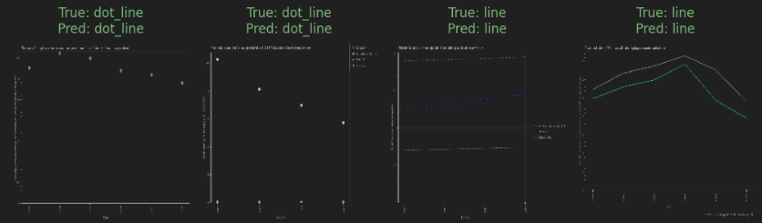
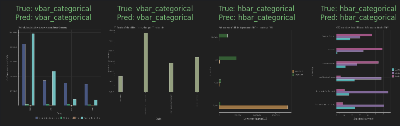
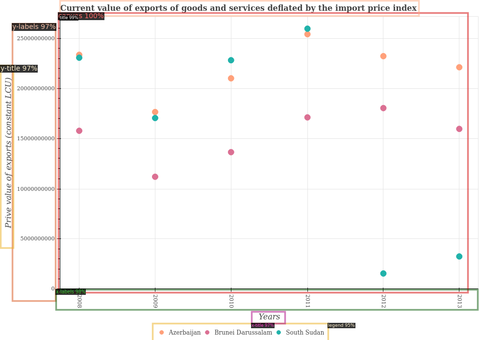
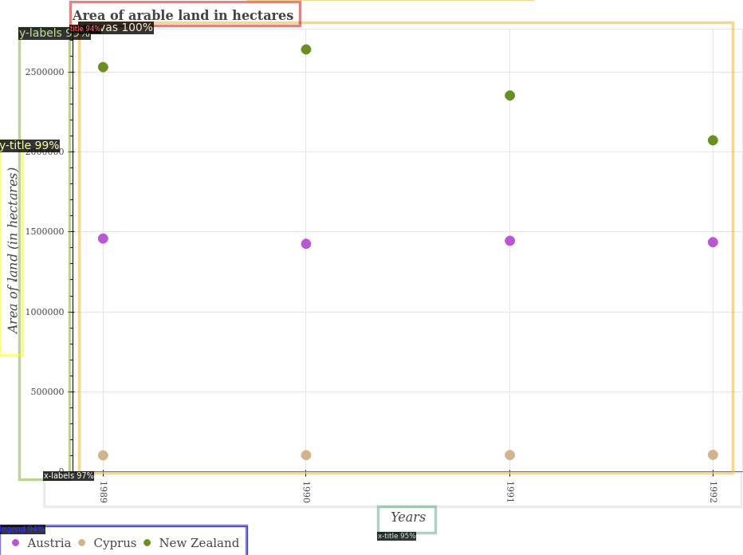
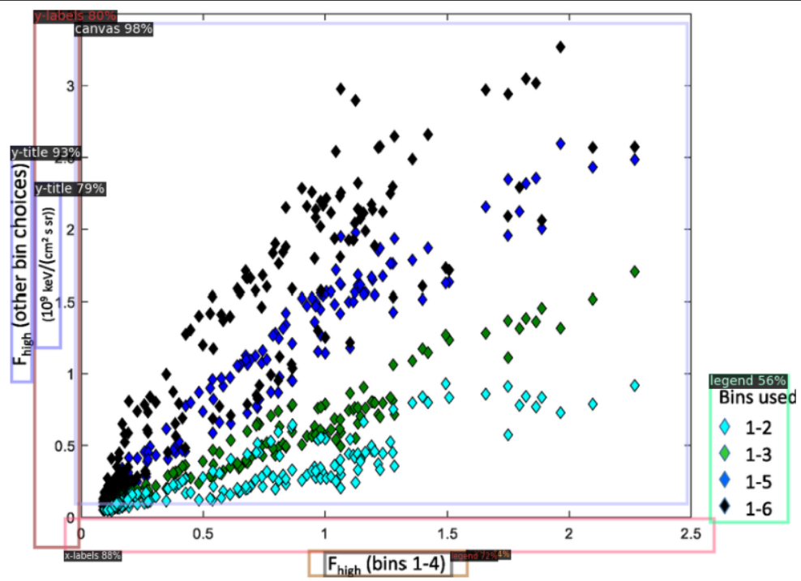

# Chart Detection

## Overview
Data visualization plays a crucial role in transforming raw data into meaningful insights. Among the various tools 
available, charts stand out for their simplicity, clarity, and ability to represent data in an easily interpretable 
format. Charts, in their various forms, have been widely used for decades to illustrate comparisons among categories, 
track changes over time, and highlight relationships between variables. However, the application of charts goes beyond 
mere presentation. Chart Analysis allows for a deeper understanding of the characteristics embedded within the data, 
thereby enabling more informed decision-making.

## Chart Type Detection
The first step for chart analysis is detecting the type of chart. This step is crucial in ensuring that the correct 
analysis techniques are applied based on the chart type. For this task, I utilized the **PlotQA dataset**, which provides 
a diverse collection of charts in various formats. This dataset had four categories: vbar categorical, hbar categorical, 
dot line, and line. These categories represent a vertical bar graph, horizontal bar graph, a scatter plot with a trend 
line, and a line graph, respectively. This detection process is a fundamental step in automating chart analysis, as it 
lays the groundwork for subsequent tasks such as trend detection, data interpretation, and anomaly identification.

The model architecture used in this work is inspired by **VGGNet (Visual Geometry Group Network)**, as described in the 
paper **BarChartAnalyzer: Digitizing Images of Bar Charts**. This design was chosen because charts often have complex 
visual features that can be effectively captured by the multiple convolutional layers of VGGNet.

Although using a model inspired by VGGNet for detecting features in the graph gives very accurate results, it also takes
a lot of computations causing longer training times and the need for more powerful hardware. As a result, I decided use 
a simpler model with fewer convolutional layers. By training on a set of 8000 images and validating on 7000 images, I 
was able to get an accuracy of 99.7%. Finally testing on another 7000 images also gave a test score of 99.7%. As a 
result, this model performs marginally better than the previous one (although this might be because of increase in 
sample size) and uses lesser layers. Nonetheless, it is a much simpler model and has a similar performance as the one 
before.

The code for chart type detection can be found in [ChartTypeDetection.ipynb](ChartTypeDetection.ipynb). This code uses 
the PlotQA Dataset.

## Scatter Plot Element Detection

Next, the project focuses on detection components of scatter plots such as the title, canvas, x-labels, etc. The dataset
follows from the **PlotQA Dataset,** but the annotations are in **COCO annotation format** which were annotated using 
**CVAT** or **Computer Vision Annotation Tool**. It contains labeled scatter plot images with bounding box annotations 
for each chart component. These annotations help train the model to recognize and localize elements accurately. The 
model architecture used for detection is inspired by **Detectron2**, a state-of-the-art object detection framework 
developed by Facebook AI. Detectron2 was chosen due to its robust feature extraction capabilities and adaptability to 
structured visual data such as charts. The model was trained and evaluated on about 150 images resulting in accurate 
results as shown in these unseen sample images.  

## Biases in the Scatter Plot Element Detection

One of the issues I noticed while annotating the images was that there were certain biases in the **PlotQA** dataset 
for scatter plot images. For example, the x-axis title was almost always _years_, and the _legend_ was always outside 
the _canvas_ area. Consequently, it is possible that the model could have picked up on these biases when detecting 
the chart element components.

As expected, the x-axis title is detected as x-axis title correctly but also as the legend incorrectly. Similarly, as 
the y-axis title had two components which was not seen in the PlotQA dataset, the model categorized it correctly as the
y-axis title but incorrectly as the y-labels. 

While some biases exist in the **PlotQA Dataset,** if the models are used for images from this dataset, the models
accurately predict the elements correctly even for unseen images. 