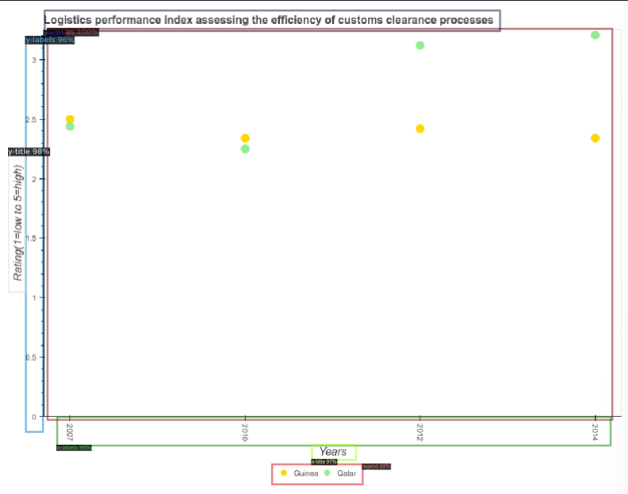
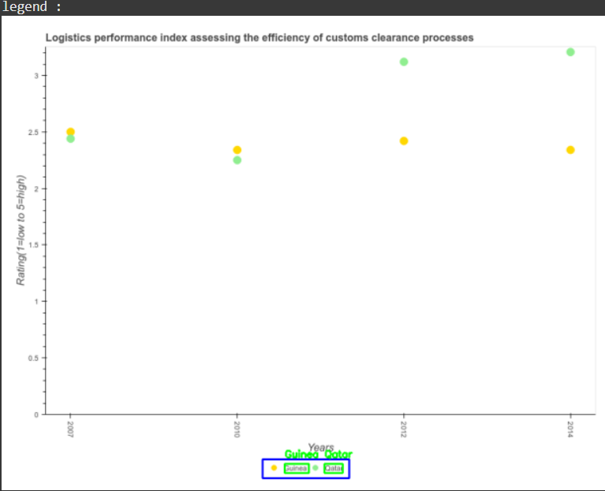
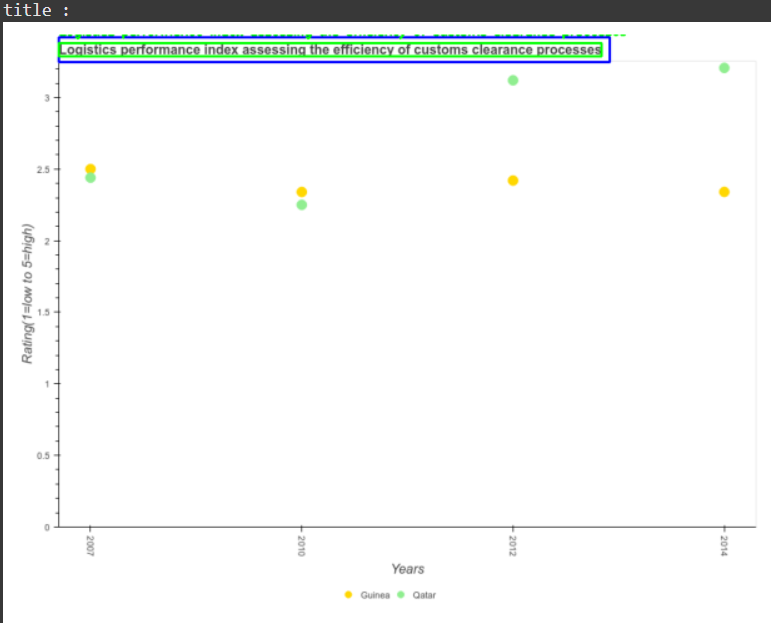
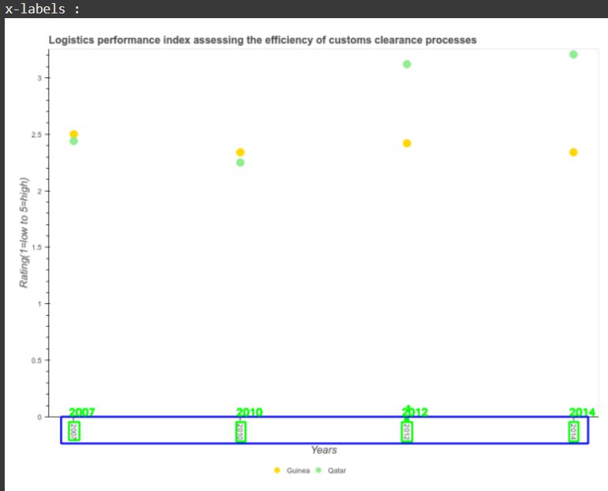
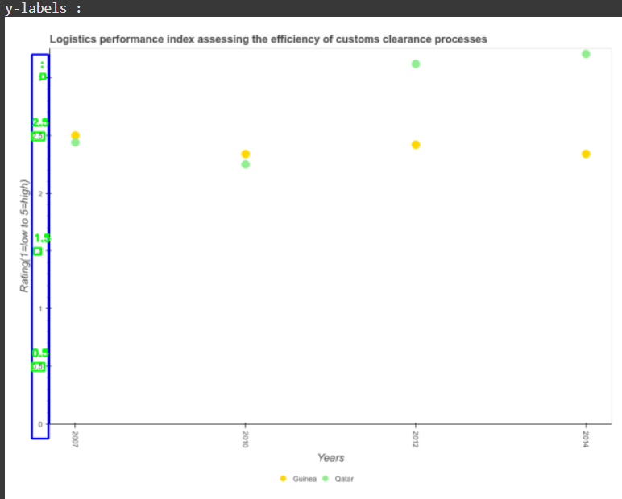

# Chart Detection

## Overview
Data visualization plays a crucial role in transforming raw data into meaningful insights. Among the various tools 
available, charts stand out for their simplicity, clarity, and ability to represent data in an easily interpretable 
format. Charts, in their various forms, have been widely used for decades to illustrate comparisons among categories, 
track changes over time, and highlight relationships between variables. However, the application of charts goes beyond 
mere presentation. Chart Analysis allows for a deeper understanding of the characteristics embedded within the data, 
thereby enabling more informed decision-making.

## Chart Type Detection
The first step for chart analysis is detecting the type of chart. This step is crucial in ensuring that the correct 
analysis techniques are applied based on the chart type. For this task, I utilized the **PlotQA dataset**, which provides 
a diverse collection of charts in various formats. This dataset had four categories: vbar categorical, hbar categorical, 
dot line, and line. These categories represent a vertical bar graph, horizontal bar graph, a scatter plot with a trend 
line, and a line graph, respectively. This detection process is a fundamental step in automating chart analysis, as it 
lays the groundwork for subsequent tasks such as trend detection, data interpretation, and anomaly identification.

The model architecture used in this work is inspired by **VGGNet (Visual Geometry Group Network)**, as described in the 
paper **BarChartAnalyzer: Digitizing Images of Bar Charts**. This design was chosen because charts often have complex 
visual features that can be effectively captured by the multiple convolutional layers of VGGNet.

Although using a model inspired by VGGNet for detecting features in the graph gives very accurate results, it also takes
a lot of computations causing longer training times and the need for more powerful hardware. As a result, I decided use 
a simpler model with fewer convolutional layers. By training on a set of 8000 images and validating on 7000 images, I 
was able to get an accuracy of 99.7%. Finally testing on another 7000 images also gave a test score of 99.7%. As a 
result, this model performs marginally better than the previous one (although this might be because of increase in 
sample size) and uses lesser layers. Nonetheless, it is a much simpler model and has a similar performance as the one 
before.


The code for chart type detection can be found in [ChartTypeDetection.ipynb](ChartTypeDetection.ipynb).

## Scatter Plot Element Detection

Next, the project focuses on detection components of scatter plots such as the title, canvas, x-labels, etc. The dataset
follows from the **PlotQA Dataset,** but the annotations are in **COCO annotation format** which were annotated using 
**CVAT** or **Computer Vision Annotation Tool**. It contains labeled scatter plot images with bounding box annotations 
for each chart component. These annotations help train the model to recognize and localize elements accurately. The 
model architecture used for detection is inspired by **Detectron2**, a state-of-the-art object detection framework 
developed by Facebook AI. Detectron2 was chosen due to its robust feature extraction capabilities and adaptability to 
structured visual data such as charts. The model was trained and evaluated on about 150 images resulting in accurate 
results as shown in these unseen sample images.  


The code for scatter plot element detection can be found in [ScatterPlotElementDetection.ipynb](ScatterPlotElementDetection.ipynb). This
code uses the PlotQA Dataset for images but custom annotations. The training, testing, and validation dataset adapted from
PlotQA can be found in this [dataset](https://drive.google.com/drive/folders/1VflyhiSskC1-7se6Mzw3351cwwDndeVs?usp=sharing_).

## Biases in the Scatter Plot Element Detection

One of the issues I noticed while annotating the images was that there were certain biases in the **PlotQA** dataset 
for scatter plot images. For example, the x-axis title was almost always _years_, and the _legend_ was always outside 
the _canvas_ area. Consequently, it is possible that the model could have picked up on these biases when detecting 
the chart element components.


As expected, the x-axis title is detected as x-axis title correctly but also as the legend incorrectly. Similarly, as 
the y-axis title had two components which was not seen in the PlotQA dataset, the model categorized it correctly as the
y-axis title but incorrectly as the y-labels. 

While some biases exist in the **PlotQA Dataset,** if the models are used for images from this dataset, the models
accurately predict the elements correctly even for unseen images. 

## Chart Text Detection

Text extraction from charts presents distinct challenges due to variations in font styles, orientations, and numerical 
formats. To tackle this, EasyOCR has been employed as the primary tool, offering a robust solution for recognizing text 
in such complex environments. However, to maximize recognition accuracy, additional preprocessing steps are essential.

One key issue was extracting numerical values from the charts. More often than not, the numerical characters were often
interpreted as alphabetic ones. Consequently, to mitigate this, the OCR engine is configured to specifically identify 
numeric characters when applicable, minimizing errors caused by incorrect character interpretation.

Moreover, sometimes the axes labels contain rotated text, which can significantly hinder recognition accuracy. To address 
this, an automated rotation correction process has been integrated, ensuring that all text is aligned horizontally before 
being processed by EasyOCR. This adjustment greatly improves both the readability and precision of detected text.


The code for chart type detection can be found in [ChartTextDetection.ipynb](Original%20Text%20Detection/ChartTextDetection.ipynb).

## Combining All the Above Steps

To test the entire process on an actual image, I ran the models on a sample image randomly selected from the **PlotQA Dataset**.


The first step was to determine the chart type. Using the **CNN model**, the image was correctly classified as a "dot_line" chart. 
Next, I used the **Detectron2 model** to identify chart elements such as the title, canvas, and axes. The output is shown below:



Finally, I applied text detection to extract the text from each detected component:


While the overall process worked, the text detection results were not entirely accurate and require further improvements.

The code for scatter plot detection can be found in [ScatterPlotDetection.ipynb](Original%20Text%20Detection/ScatterPlotDetection.ipynb).

## Improving Chart Text Detection
I initially employed EasyOCR and Tesseract for extracting text from different chart regions. While these tools provided 
reasonable results, they exhibited some limitations in terms of accuracy and robustness, particularly when handling 
rotated texts. To address these challenges, I drew inspiration from the paper "CMA: An End-to-End System for Reverse Engineering Choropleth Map Images". 
This study presented a comprehensive six-step workflow utilizing deep learning architectures and tools to effectively 
reverse-engineer choropleth maps. In this paper, the authors used PaddleOCR for text extraction and found that it 
significantly improved the accuracy of identifying and extracting textual information from the map images. As a result, 
motivated by these insights, I integrated PaddleOCR in my application. It demonstrated improved performance in detecting
and recognizing text within charts, especially when dealing with rotated or non-standard text orientations. 






The code for text detection can be found in [ChartTextDetection.ipynb](ChartTextDetection.ipynb) and for scatter plot detection in [ScatterPlotDetection.ipynb](ScatterPlotDetection.ipynb).

## Tech Stack
- Tensorflow: Open-source framework for building and deploying machine learning models.
- Keras: High-level neural networks API, running on top of TensorFlow, for easier and faster model development.
- OpenCV: For image processing and pre-processing tasks, especially in vision-related tasks.
- Convolutional Neural Networks (CNNs): Deep learning architecture for image classification and analysis.
- Visual Geometry Group (VGG) Network: A specific CNN architecture known for its deep layers and use in image recognition tasks.
- Detectron2: A library built by Facebook AI Research (FAIR) for object detection tasks.
- EasyOCR: An open-source Optical Character Recognition (OCR) tool that simplifies the extraction of text from images.
- Tesseract: An open-source OCR engine developed by Google that is used for recognizing text in images and converting it to machine-readable text.
- PaddleOCR: An open-source OCR library, designed to perform high-accuracy text detection and recognition in various languages, including complex scripts.

## Frameworks and Dataset
- NumPy: For numerical computations and handling arrays.
- Matplotlib: For visualizing training progress, losses, and accuracy metrics.
- CVAT (Computer Vision Annotation Tool): An open-source tool for annotating images for training object detection models.
- COCO (Common Objects in Context): A dataset used for object detection and segmentation tasks, which pairs well with Detectron2 for object recognition and segmentation.
- PlotQA: A dataset designed for visual question answering (VQA) tasks, where models are trained to answer questions based on visual content, like interpreting plots and figures.

## References

- P. N. Butani, J. Sreevalsan-Nair, and N. Kamat, “Cma: An end-to-end system for reverse engineering choropleth map images,” IEEE Geoscience and Remote Sensing Letters, vol. 21, pp. 1–5, 2024, presented in the GRSL Special Stream at the 37th Conference on Graphics, Patterns and Images (SIBGRAPI 2024). [Online]. Available:https://ieeexplore.ieee.org/document/10637448
- Y. Wu, A. Kirillov, F. Massa, W.-Y. Lo, and R. Girshick, “Detectron2,”https://github.com/facebookresearch/detectron2, 2019. 
- A. Bergman et al., “Cvat: Computer vision annotation tool,” 2024, accessed: 2025-01-11. [Online]. Available: https://github.com/openvinotoolkit/cvat
- N. Methani, P. Ganguly, M. M. Khapra, and P. Kumar, “Plotqa:Reasoning over scientific plots,” in The IEEE Winter Conference on Applications of Computer Vision (WACV), March 2020. 
- T. LeNail, “Nn-svg: Publication-ready neural network architecture schematics,” Journal of Open Source Software, vol. 4, no. 33, p. 747, 2019. [Online]. Available: https://doi.org/10.21105/joss.00747
- K. Simonyan and A. Zisserman, “Very deep convolutional networks for large-scale image recognition,” in 3rd International Conference on Learning Representations (ICLR 2015), Y. Bengio and Y. LeCun, Eds., San Diego, CA, USA, May 7-9 2015, p. Conference Track Proceedings. 
- K. Dadhich, S. Daggubati, and J. Sreevalsan-Nair, “Barchartanalyzer:Digitizing images of bar charts,” in International Conference on Image Processing and Vision Engineering, 01 2021, pp. 17–28. 
- K. Kalra. (2023, Jul.) Convolutional neural net-works for image classification. Accessed: 2025-01-17. [Online]. Available: https://medium.com/@khwabkalra1/convolutional-neural-networks-for-image-classification-f0754f7b94aa
- T. Karlsson, S. Raptis, H. Trollvik, and H. Nilsson, “Classifying the magnetosheath behind the quasi-parallel and quasi-perpendicular bow shock by local measurements,” Journal of Geophysical Research: Space Physics, vol. 126, 09 2021. 
- J. AI, “Easyocr: Ready-to-use ocr with 80+ supported languages,” https://github.com/JaidedAI/EasyOCR, 2024, accessed: 2025-02-23. 
- R. Smith, “An overview of the tesseract ocr engine,” in Proceedings of the Ninth International Conference on Document Analysis and Recognition (ICDAR), 2007, pp. 629–633. [Online]. Available:https://ieeexplore.ieee.org/document/4376991
- P. Contributors, “Paddleocr: Awesome multilingual ocr toolkits based on paddlepaddle,” https://github.com/PaddlePaddle/PaddleOCR, 2023, accessed: 2025-03-10.
    
## Citing Chart Analysis
If you use Chart Analysis in your research or refer to these results, please use the following BibTeX entry.

```bibtex
@misc{AryanAAB,
  author    = {Aryan Bansal},
  title     = {Chart-Detection},
  year      = {2025},
  howpublished = {\url{https://github.com/AryanAAB/Chart-Detection/}},
}